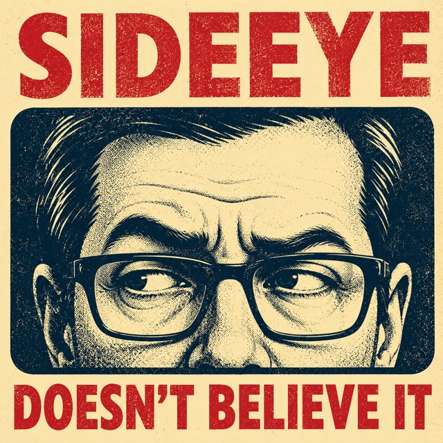

# sideeye

<p align="center">
  
</p>

> *Sideeye doesn't believe it.*

Sideeye is a deterministic skeptic for the coding loop. You declare an invariant — *"if this operation said it succeeded, this must still be true after a restart"* — and Sideeye explores the worlds where your process died partway through, then brings back the **smallest reproducible counterexample**.

It breaks worlds, not inputs: same input, hostile universe.

## Status

**v0.1 — the feasibility milestone, released.** It proves the assumption everything else
rests on: a process can be killed deterministically immediately before its k-th
operation that can change state, the resulting worlds can be judged, and the same run
produces the same verdict on Linux and macOS. What it will not do is guess — a target it cannot fully observe is
reported UNKNOWN, never as passing.

The Define contract, the report schema and the exit codes are **not frozen** until 1.0 and
may change in any release. See [CHANGELOG.md](CHANGELOG.md) for what this version does and
[PRD.md](PRD.md) for what comes next.

| Document | What it is |
|----------|------------|
| [DESIGN.md](DESIGN.md) | What Sideeye is, and what it refuses to be |
| [PRD.md](PRD.md) | The road from v0.1 to v1.0 |
| [BUILDLOG.md](BUILDLOG.md) | Decisions as they happen, including the wrong ones |
| [CHANGELOG.md](CHANGELOG.md) | Releases |

### What the target has to do for v0.1

Sideeye refuses to guess. A target outside these limits is reported UNKNOWN (exit 2),
never as passing.

- **Exit zero during the recording run.** The crash points are read off that run, so a
  target that fails partway through would have Sideeye explore a sequence it never
  performs. There is no way yet to declare a different expected status.
- **Be dynamically linked and single-threaded**, and reach its files through libc.
  Raw syscalls, static linking, a hardened runtime and threads are detected and refused.
- **Keep other processes away from its state.** A target that forks or spawns helpers is
  explorable when an oracle is present (`--oracle`, Linux) and no process other than the
  target itself touched the state directory — the common shim/wrapper/launcher shape.
  A child that writes into the state directory, a target that `exec`s over itself, or a
  process that leaves Sideeye's containment group is refused. Without an oracle, any
  process boundary is UNKNOWN: the shim only sees processes that load it, and "was not
  seen" is not "did nothing".
- **Keep its state in one directory**, passed with `--state`.

## What it looks like

Against a tool with a delete-before-rename bug — real output, not a mock-up:

```
$ sideeye explore --state /tmp/se/state \
    --setup "mytool init" --operation "mytool rotate" \
    --check ./check.sh --shim ./zig-out/lib/libsideeye_shim.dylib \
    --work /tmp/se/work --allow-unverified

FAIL  1 of 6 crash worlds violated an invariant

invariant   built-in atomicity, and the checker
earliest    crash point 5 of 5
            after  unlink(/tmp/se/state/key.json)
            before rename(/tmp/se/state/key.json.tmp)
path        key.json
observed    present before and after the operation, but gone from the crashed state
explored    6 worlds (crash points 5 + 1 baseline)
oracle      NOT VERIFIED (--allow-unverified) — nothing checked what the shim reported
checker     falsified before the run (corrupted state -> check failed)
not tested  power loss, torn writes, concurrent processes

reproduce   SIDEEYE_STATE_DIR=/tmp/se/state SIDEEYE_TRACE_PATH=/tmp/se/work/trace-repro.bin DYLD_INSERT_LIBRARIES=./zig-out/lib/libsideeye_shim.dylib SIDEEYE_KILL_AT=5 <operation>
```

Read the last four lines first. `explored` says how much was looked at, `oracle` says
whether anything checked that account, `checker` says the invariant was shown to be
capable of failing before the run began, and `not tested` says what this verdict is
silent about. A report that only said FAIL would be asking to be believed.

`--json` writes the same content for a caller to branch on. Exit codes are 0 PASS,
1 FAIL, 2 UNKNOWN, 3 SETUP ERROR — and UNKNOWN is never 0.

The `check` script is where the interesting invariants live. This one cross-examines the
tool's own diagnostic:

```sh
#!/bin/sh
# The invariant is not "the key is readable" — a tool is allowed to be broken as long as
# it says so. The invariant is that the claim and the observable truth agree.
claim=$("$TOY" doctor 2>/dev/null) || claim="unhealthy"
"$TOY" load-key >/dev/null 2>&1 && reality="loadable" || reality="unloadable"

case "$claim:$reality" in
    healthy:loadable | unhealthy:unloadable) exit 0 ;;
    *) echo "doctor says '$claim' but the key is $reality" >&2; exit 1 ;;
esac
```

The full version is [`spike/check.sh`](spike/check.sh). Sideeye refuses to trust a checker
it has not seen fail: before exploring, it overwrites the state with junk and requires the
check to reject it. A checker that cannot fail makes the run UNKNOWN, not PASS.

The define surface — three commands and one directory ([DESIGN.md](DESIGN.md) §12) —
can be a `sideeye.toml`, passed with `--config`:

```toml
[world]
state = "./state"               # resolves against this file's directory

[define]
setup     = "mytool init"
operation = "mytool rotate-key"
check     = "./check.sh"        # exit 0 = invariant holds, run after crash + restart
marker    = "Recorded"          # optional: the operation's own success claim (L1) —
                                # in worlds where it reached stdout before the kill,
                                # the new state must survive
```

A FAIL saves its counterexample to `<work>/cases/NNNNNN.json` and prints the
ready-to-paste `sideeye replay <case.json>` line. Replay re-runs the same pipeline —
every trust gate included — restricted to that crash point; when the code changed
underneath the case, the answer is `case no longer applies`, never a verdict about a
shifted address.

The parser accepts exactly this shape and refuses everything else with the offending
line named — an ignored key would be a declared invariant that silently never fires.
`--config` is mutually exclusive with the define-surface flags
(`--state`/`--setup`/`--operation`/`--check`); operational flags (`--shim`,
`--oracle`, `--work`, `--json`, `--allow-unverified`) stay flags and combine with it.
Command strings split on spaces — no quoting; anything an argument cannot spell
belongs in a script file (ADR 0007).

## Driving it from an agent (MCP)

`sideeye mcp` is a stateless MCP server (stdio, protocol 2026-07-28) so a coding agent
can drive sideeye through the standard tool surface. Two tools, both taking a path
inside `SIDEEYE_MCP_ROOT`:

- `sideeye_explore_config` `{config_path}` — explore a target defined by a `sideeye.toml`
- `sideeye_replay_case` `{case_path}` — replay a saved counterexample case

The tools take *paths*, never a raw command: the operation lives in the config file,
which is a **trust boundary** — its operation is executed, so the config is what you
vet, and the server confines *which* config (inside the root), not what it may do.
Operational settings come from the environment, not tool input: `SIDEEYE_MCP_SHIM`
(required), `SIDEEYE_MCP_ROOT` (required), `SIDEEYE_MCP_ORACLE`, `SIDEEYE_MCP_WORK`
and `SIDEEYE_MCP_CHILD_ENV` (optional). The server self-execs the canonical binary,
captures the child's output so it never touches the MCP transport, and runs it with a
near-minimal environment: PATH, plus exactly the variable names the operator lists in
`SIDEEYE_MCP_CHILD_ENV` (comma-separated), each resolved from the server's own
environment — for targets that locate their state through a variable, like
timewarrior's `TIMEWARRIORDB` (ADR 0011). A listed name absent from the server
environment is a loud tool error. The list is the operator's trust decision: names
like `LD_PRELOAD` or `DYLD_INSERT_LIBRARIES` would load code into the child, so list
only what the target reads. Replays through this surface always run with
`--fresh-state` — the server lives for the whole client session, and the case's state
directory is emptied before each setup so the second replay does not die in the
leftovers of the first. v1 is synchronous — a long exploration blocks the connection;
async is future work.

## What Sideeye is not

- **Not a property-based testing library.** It varies the world the program runs in, not the input.
- **Not an AI code reviewer.** Verdicts are deterministic; a language model never decides PASS or FAIL.
- **Not a chaos platform.** One binary, ordinary software, local state.
- **Not a certification.** A PASS is a search record, not a safety claim — every report says what was *not* tested.

## v0 scope

Process crash × persistent state consistency, for stateful CLIs and local tools that keep their state in files. Power loss, network faults, clocks, and concurrency are explicitly out of scope for v0 — see [DESIGN.md](DESIGN.md) §9 and §15.

## License

Licensed under either of [Apache License 2.0](LICENSE-APACHE) or [MIT License](LICENSE-MIT), at your option.
