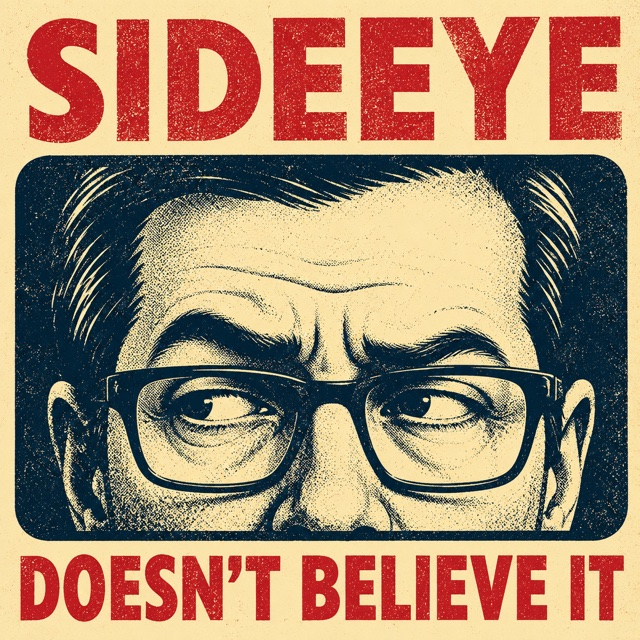

# sideeye
[](https://github.com/yottayoshida/sideeye/actions/workflows/ci.yml?query=branch%3Amain) [](https://github.com/yottayoshida/sideeye/releases/latest)
<p align="center"></p>

Sideeye finds out what your program leaves on disk when it dies at the worst possible moment. Declare an invariant — *"if this operation said it succeeded, this must still hold after a restart"* — and Sideeye kills your process before each state-changing operation, one crash world each, and brings back the earliest failing one as a replayable case.

`sideeye demo`, trimmed, checked line by line in CI:

<!-- demo-output:begin -->
```
FAIL  1 of 6 explored worlds violated an invariant

invariant   built-in atomicity, and the checker
earliest    crash point 5 of 5
            after  unlink(…/state/key.json)
            before rename(…/state/key.json.tmp)
path        key.json
observed    present before and after the operation, but gone from the crashed state
explored    6 worlds (crash points 5 + 1 baseline)
checker     falsified before the run (corrupted state -> check failed); ran in 6 world(s)
case        …/work/cases/000001.json
not tested  power loss, torn writes, concurrent processes
```
<!-- demo-output:end -->

Counterexamples found: RuboCop, ImageMagick, the AWS CLI, [more](docs/found.md) — [four fixes](docs/case-studies.md). A target Sideeye cannot fully observe is UNKNOWN, never a silent PASS — except unrecorded writes under a directory a recorded `rename` moved in from outside, counted as `paths_attributed_to_rename` in every JSON report ([why](DESIGN.md#the-one-named-exception-a-directory-renamed-in-from-outside)).

## Installation

Runs on macOS 14+ (Apple silicon) and Linux glibc (x86_64, aarch64): Homebrew, or a [release](https://github.com/yottayoshida/sideeye/releases) tarball run where you unpack it. Other platforms, building from source: [docs/cli.md](docs/cli.md#platforms).

```
$ brew install yottayoshida/tap/sideeye

$ tar xzf sideeye-v1.10.0-aarch64-macos.tar.gz && cd sideeye-v1.10.0-aarch64-macos
$ ./sideeye version
```

## Usage

```
$ sideeye demo
$ sideeye preflight --state <dir> --operation "<cmd>"
$ sideeye explore --config sideeye.toml --oracle /usr/bin/strace
$ sideeye explore --config sideeye.toml --allow-unverified
```

- **`demo`** — sixty seconds, no compiler; one directory left under `$TMPDIR` (or `/tmp`) with the saved case. Exit 1, the bug found, is success.
- **`preflight`** — can Sideeye watch your tool? One observed run: `recording accepted`, or a refusal naming the detector.
- **`explore`** — the real thing; the define in one file:

```toml
[world]
state = "./state"               # your tool's state

[define]
cwd       = "."                 # relative arguments resolve here
setup     = "mytool init"
operation = "mytool rotate-key" # the shim is inserted into this one, not into setup or check
check     = "./check.sh"        # exit 0 = invariant holds
```

`operation` is the one command the shim is inserted into; command strings split on spaces, no quoting. `--oracle` is a second witness, the kernel's account (Linux; on macOS, `--oracle-fs-usage`); without one, PASS needs `--allow-unverified`, and the report says so. `--shim` names the shim when it is not beside the binary; `--work` moves the scratch directory. Exit codes: **0 PASS, 1 FAIL, 2 UNKNOWN, 3 SETUP ERROR**. A FAIL saves a replayable case, and `sideeye evidence <case>` renders it for an issue tracker. Run `explore --config` in CI ([docs/ci-quickstart.md](docs/ci-quickstart.md)). For agents there is `sideeye mcp`, and three skills (`npx skills@1.7.1 add yottayoshida/sideeye`): [docs/mcp.md](docs/mcp.md).

## Writing the check

The check, like the setup, receives the state directory in `$SIDEEYE_STATE_DIR`. This one cross-examines the tool's own diagnostic; the violation is the claim and the observable truth disagreeing:

```sh
claim=$("$TOY" doctor 2>/dev/null) || claim="unhealthy"
"$TOY" load-key >/dev/null 2>&1 && reality="loadable" || reality="unloadable"
case "$claim:$reality" in
    healthy:loadable | unhealthy:unloadable) exit 0 ;;
    *) echo "doctor says '$claim' but the key is $reality" >&2; exit 1 ;;
esac
```

Sideeye refuses to trust a checker it has not seen fail: it corrupts the state first. A checker that cannot fail makes the run UNKNOWN, not PASS; so does an exploration in which no world could have failed ([conditions](docs/report-schema.md)).

## What the target has to be

Sideeye refuses to guess: outside these limits the verdict is UNKNOWN, naming the detector. Reasons: [DESIGN.md](DESIGN.md#known-constraints-declared-not-hidden).

- **Dynamically linked**, reaching files through libc; static only under `--observe supervised` (Linux). Hardened runtimes are refused. Threads are judged where a creation or a join the shim saw orders their writes.
- **Under `--observe syscalls`, a process whose `SIGSYS` is blocked or reset dies at its first state-changing call** — an `exec`'d image the shim cannot reach, a `posix_spawn` child.
- **Byte-repeatable writes** (`preflight --twice` checks), **state in one directory**, **a clean run exits its declared success status**.
- **Other processes take turns with the state**, and every writing child is reaped; a process boundary needs Linux's `--oracle`, and one that leaves its process group is judged only where the engine can hold the run in a cgroup (Linux) — otherwise UNKNOWN.
- **On macOS, a framework Python's `bin/python3` is a launcher**; Sideeye refuses it and names the interpreter to run instead.

No language model decides a verdict; a PASS is a search record naming what was *not* tested.

## Documentation

[docs/faq.md](docs/faq.md) · [docs/cli.md](docs/cli.md) · [docs/mcp.md](docs/mcp.md) · [DESIGN.md](DESIGN.md) · [docs/report-schema.md](docs/report-schema.md) · [docs/target-classes.md](docs/target-classes.md) · [CHANGELOG.md](CHANGELOG.md) · [docs/](docs/)

## License

[MIT](LICENSE-MIT) or [Apache-2.0](LICENSE-APACHE), at your option.
